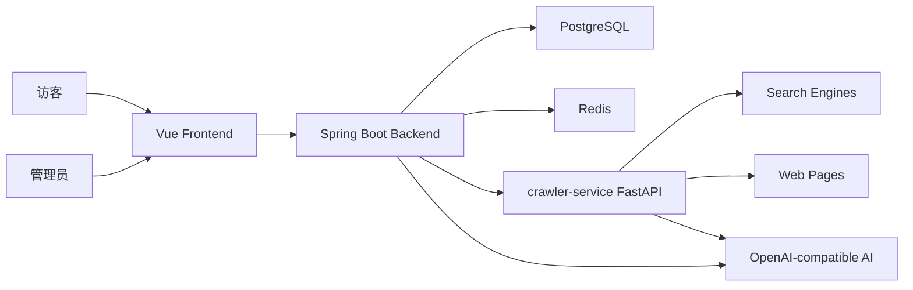

# Nanmuli Blog - Agent 协作规范

> 当前版本：MVP Beta 试用版
> 更新时间：2026-06-03
> 技术栈：Spring Boot 3.3、Java 21、Vue 3、FastAPI、PostgreSQL、Redis、Crawl4AI

---

## Global Bootstrap

完整路由规则已迁移到本地 skill：`rule-router`。非闲聊任务先使用 `rule-router`，再按任务类型加载对应规则。

## Core Rules

- 中文回复，技术术语保留 English。
- 不确定即查；涉及文件、API、路径、参数时，先读代码或官方文档。
- 修改前先读相关文件；改函数、类型、字段、配置前先搜所有引用。
- 只做用户目标相关的最小变更，不做无关重构或格式整理。
- 修改后必须验证：测试、构建、类型检查、grep、curl 或读回确认。
- 失败后先定位根因，最多两轮修复；仍失败则报告卡点和已排除项。
- 不可逆操作必须确认：删库、生产数据删除、远程资源删除、force push main/master。

## Rule Routing

- 开发、bug、重构、测试、构建：加载 `core-dev`，按语言/框架追加规则。
- Java、Spring Boot、MyBatis、DDD、本项目后端：追加 `java-spring-ddd`。
- Vue、前端、UI、样式、交互：追加 `frontend-ui`。
- 安全、审计、漏洞、权限、SQL 注入、XSS：追加 `security-audit`。
- Git、commit、push、PR、release：追加 `git-github`。
- 部署、CI/CD、上线、回滚、Docker：追加 `deployment`。
- Prompt、Agent、RAG、评测：追加 `prompt-agent-rag`。
- 飞书、Lark、lark-cli：优先使用对应 `lark-*` skill。
- 若路由不确定，读取 `C:\Users\nanmu\.claude\skills\rule-router\SKILL.md`。

---

## 当前项目状态

当前版本可作为 **MVP Beta 试用版** 初步上线试用。开发基线以以下文档为准：

- `README.md`
- `docs/trial-release-roadmap.md`
- `docs/digest-system.md`
- `docs/web-collector-module-design.md`
- `docs/future-development-plan.md`
- `crawler-service/README.md`

### 已达到试用标准的能力

| 模块 | 状态 | 说明 |
|------|------|------|
| 文章管理 | 可试用 | Markdown 编辑、发布、分类、摘要/HTML、置顶、公开展示 |
| 技术日志 | 可试用 | 管理端维护、公开展示 |
| 分类管理 | 可试用 | 树形分类、叶子分类关联文章 |
| 个人展示 | 可试用 | 技能、项目展示 |
| 文件管理 | 可试用 | 上传、静态访问、基础限制 |
| 认证授权 | 可试用 | Sa-Token 管理端保护 |
| 系统配置 | 可试用 | 管理端配置、后端配置读取、crawler 配置同步 |
| Web 采集器 | MVP Beta | 独立 FastAPI 服务、搜索/单页/深度采集、质量过滤、API Key 接入 |
| 日报生成系统 | MVP Beta | 手动触发、工作日定时、结构化保存、公开展示 |
| 自动优化系统 | MVP Beta | 质量评分、趋势记录、弱点建议、优化记录查询 |
| 友链管理 | 可试用 | 管理端 CRUD、公开展示 |
| 标签系统 | 未上线 | 当前仅有数据库表，暂不作为 MVP 试用承诺 |

### 最近验证基线

- Backend：`mvn test`，75 tests passed。
- Crawler：`python -m pytest -q --tb=short`，1266 passed，1 warning。
- Frontend：`npm run build` 通过。
- Frontend prod audit：0 vulnerabilities。
- Docker Compose：`docker compose --env-file .env.example config` 通过。
- Frontend Docker build：`docker compose --env-file .env.example build frontend` 通过。

---

## 架构概览

### 后端分层

- `domain`：领域实体、值对象、仓储接口、领域规则。
- `application`：应用服务、Command、DTO、Query、事务编排。
- `interfaces`：REST Controller、异常处理、过滤器。
- `infrastructure`：Mapper、RepositoryImpl、配置、外部服务客户端。
- `shared`：统一响应、异常、工具类。

### Crawler Service

`crawler-service` 需要作为可复用服务设计，不只服务博客系统。当前最多考虑博客系统和另一个内部服务两个调用方，因此优先保持：

- HTTP API 清晰。
- API Key 认证可开关。
- 调用方通过 `X-Client-Id` 区分。
- 配置可由环境变量、配置文件、博客后端同步共同驱动。
- 不引入复杂多租户，避免 MVP 复杂度失控。

---

## 开发规范

### 后端

- Controller 只做入参接收、校验激活和结果返回，禁止写业务逻辑。
- AppService 一个方法对应一个用例，负责事务和跨聚合编排。
- Repository 接口放领域层，实现放基础设施层。
- 写操作使用 `@Transactional`，查询默认 `@Transactional(readOnly = true)`。
- 管理接口统一走 `/api/admin/**`，公开接口走 `/api/**`。
- 入参使用 Bean Validation；统一返回 `Result<T>`。
- 外部服务调用使用独立超时配置，不复用不合适的全局客户端。
- 事务提交后异步任务使用 `TransactionSynchronization.afterCommit()` 触发。

### 前端

- Vue 3 Composition API 优先。
- API 调用统一放在 `frontend/src/api/`。
- 管理页面保持 Element Plus 风格一致。
- 管理端新增页面要覆盖 loading、empty、error、disabled 状态。
- 不新增无关 UI 框架。

### Python Crawler

- FastAPI endpoint 入参要有 Pydantic model。
- 外部网页抓取必须有超时、重试或降级策略。
- 搜索源变化不能导致整体不可用，至少要保留 fallback。
- 日报质量相关逻辑需要有单元测试或集成测试保护。
- 新增信息源要能被配置关闭。

### 数据库

- Schema 变化使用 Flyway migration。
- 可变聚合根优先考虑乐观锁。
- JSON/JSONB 字段读写需明确序列化方式。
- 禁止无条件全表 UPDATE/DELETE。

---

## 当前优先级

1. 试用期稳定性：保证启动、登录、文章、配置、日报、采集、公开展示链路稳定。
2. 日报质量：继续减少重复来源，提升 `tech_article` 与 GitHub Trending 的有效性。
3. 自动优化闭环：将质量评估弱点转成下一轮采集强约束。
4. Crawler 独立服务：完善少量内部服务接入文档、鉴权、限流和失败隔离。
5. 运维观测：补充任务日志、失败原因、质量趋势和健康检查展示。

---

## Output

完成后简洁报告：

- 完成内容。
- 关键文件。
- 验证方式。
- 剩余风险。

不要复述完整思考链，不粘贴大段日志。
