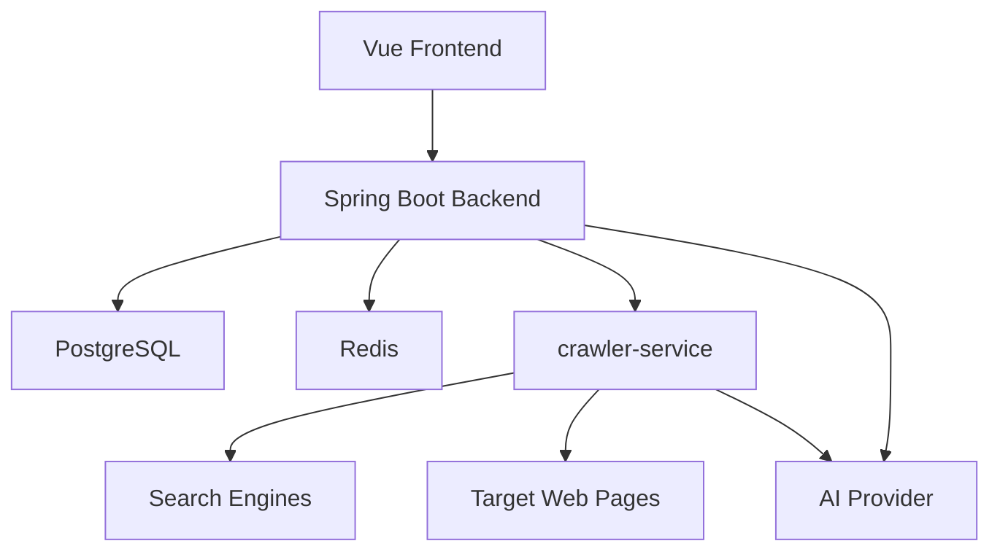

# Nanmuli Blog - Claude/Codex 项目记忆

> 当前版本：MVP Beta 试用版
> 更新时间：2026-06-03
> 维护目标：让后续 Agent 能快速理解项目状态、架构边界和开发优先级。

---

## 工作规则

- 中文回复，技术术语保留 English。
- 不确定即查，涉及代码、路径、API、字段、配置时先读项目文件或官方文档。
- 修改前先读相关文件；改函数、类型、字段、配置前先搜所有引用。
- 只做用户目标相关的最小变更，不做无关重构。
- 修改后必须验证，优先使用测试、构建、类型检查、grep、curl、读回确认。
- 遇到失败先定位根因，最多两轮修复；仍失败则报告卡点和已排除项。
- 不可逆操作必须确认。

本项目还有 `AGENTS.md`，两份文档应保持同一项目状态口径。

---

## 当前项目状态

Nanmuli Blog 当前可作为 **MVP Beta 试用版** 初步上线试用。它已经不只是普通博客，还包含 Web 采集、技术日报生成和自动优化轻闭环。

### 核心能力

| 系统 | 状态 | 说明 |
|------|------|------|
| 博客基础系统 | 可试用 | 文章、分类、技术日志、项目、技能、友链、文件、认证授权 |
| 系统配置 | 可试用 | 管理端配置、Java 后端读取、crawler 配置同步 |
| Web 采集器 | MVP Beta | 独立 FastAPI 服务，可被博客和少量内部服务调用 |
| 日报生成系统 | MVP Beta | 管理端手动触发、工作日定时、结构化章节、公开展示 |
| 自动优化系统 | MVP Beta | 质量评分、趋势记录、弱点建议、优化记录 |
| 标签系统 | 未上线 | 仅有数据库表，暂不作为试用版承诺 |

### 最近验证基线

- Backend：`mvn test`，75 tests passed。
- Crawler：`python -m pytest -q --tb=short`，1266 passed，1 warning。
- Frontend：`npm run build` 通过。
- Frontend prod audit：0 vulnerabilities。
- Compose config：`docker compose --env-file .env.example config` 通过。
- Frontend Docker build：`docker compose --env-file .env.example build frontend` 通过。

---

## 技术栈

### Backend

- Spring Boot 3.3.5
- Java 21
- MyBatis Plus 3.5.9
- PostgreSQL 15+
- Redis 7+
- Sa-Token 1.44.0
- Knife4j 4.4.0
- Flyway
- OpenAI-compatible AI endpoint

### Frontend

- Vue 3
- Vite 5
- Element Plus
- Pinia
- Vue Router
- Tailwind CSS
- md-editor-v3

### Crawler

- Python
- FastAPI
- Crawl4AI
- SQLite standalone storage
- Search engine fallback
- Optional API Key auth

---

## 架构边界

### Backend DDD 分层

- `domain`：领域实体、聚合、仓储接口、领域规则。
- `application`：应用服务、事务、用例编排、DTO/Command/Query。
- `interfaces`：REST Controller、异常处理、Filter。
- `infrastructure`：Mapper、RepositoryImpl、配置、外部系统客户端。
- `shared`：Result、PageResult、BusinessException、工具类。

### Crawler 独立服务原则

Crawler 不应重度绑定博客系统。当前设计允许最多两个内部服务调用，MVP 阶段不做复杂多租户，但保留以下能力：

- `X-API-Key` 鉴权。
- `X-Client-Id` 调用方标识。
- 健康检查和配置刷新接口。
- URL、keyword、daily digest、optimization 相关 API。
- 失败隔离：单个外部源失败不能拖垮整个服务。

---

## 关键文档

- `README.md`：项目总览、启动、验证、MVP 结论。
- `docs/README.md`：文档索引。
- `docs/trial-release-roadmap.md`：试用版上线范围和路线图。
- `docs/digest-system.md`：日报生成和自动优化系统说明。
- `docs/web-collector-module-design.md`：WebCollector 当前架构。
- `docs/future-development-plan.md`：未来开发计划。
- `docs/config-db-migration-plan.md`：配置和数据库迁移说明。
- `crawler-service/README.md`：crawler-service 独立服务使用说明。
- `deploy/README.md`：Docker Compose 部署说明。

---

## 当前优先开发方向

1. MVP Beta 试用稳定化：关注真实使用链路、错误提示、配置兜底、任务失败恢复。
2. 日报质量提升：减少重复 URL，提升信息源质量，增强章节内容深度。
3. 自动优化强闭环：将弱点建议转成下一轮采集约束，而不只是记录建议。
4. Crawler 独立服务增强：完善少量内部服务接入、鉴权、限流、调用方隔离。
5. 运维观测：补齐任务日志、健康检查、质量趋势、告警和回滚文档。

---

## 开发提醒

- 管理接口统一 `/api/admin/**`，公开接口统一 `/api/**`。
- Controller 不写业务逻辑。
- AppService 负责事务和用例编排。
- Repository 接口在领域层，实现放基础设施层。
- 前端 API 调用放 `frontend/src/api/`。
- 数据库结构变化必须 Flyway migration。
- 日报/采集/优化相关改动必须覆盖 crawler 测试或后端用例测试。
- 文档修改后至少读回或用 `rg` 验证关键状态一致。
