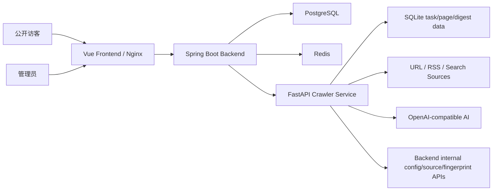

# Nanmuli Blog

> 个人技术博客系统，基于 Spring Boot 3.3 + Java 21 + Vue 3 + Python FastAPI/Crawl4AI。
> 当前版本定位：**MVP Beta 试用版**，已具备初步上线试用条件。

## 当前状态

最后复核日期：2026-06-03

当前版本可以作为个人博客后台和技术日报系统的 MVP Beta 上线试用。它不是最终正式版，但主链路已经通过验证：

| 链路 | 结论 | 最近验证 |
| --- | --- | --- |
| Backend | 可用 | `mvn test`：75 passed |
| Crawler Service | 可用 | `python -m pytest -q --tb=short`：1266 passed，1 warning |
| Frontend | 可用 | `npm run build` passed |
| Frontend prod audit | 可用 | `npm audit --omit=dev`：0 vulnerabilities |
| Docker Compose | 可用 | `docker compose --env-file .env.example config` passed |
| Frontend Docker build | 可用 | `docker compose --env-file .env.example build frontend` passed |

剩余非阻断风险：

- 前端 dev/build 工具链仍有 5 个中危 audit 项，修复需要 `vite@8`、`vue-tsc@3` 大版本升级；不进入 Nginx 运行时镜像。
- Crawler 测试在 Windows + Python 3.13 下有 1 个 event loop 资源释放 warning，不影响测试通过。
- 试用期仍需要观察日报质量、信息源稳定性、自动优化反馈是否持续改善。

## 核心能力

| 模块 | MVP 状态 | 说明 |
| --- | --- | --- |
| 文章管理 | 可用 | Markdown 编辑、发布/草稿/回收、分类、置顶、摘要、阅读时间 |
| 技术日志 | 可用 | 日常技术记录、时间线展示、标签/心情/天气字段 |
| 分类管理 | 可用 | 树形分类，仅叶子分类关联文章 |
| 项目/技能展示 | 可用 | 个人项目和技能展示 |
| 文件管理 | 可用 | 上传、预览、静态资源访问 |
| 认证授权 | 可用 | Sa-Token 管理端认证 |
| 友链管理 | 可用 | 友链 CRUD 和前台展示 |
| 系统配置 | 可用 | `sys_config` 动态配置，支持 crawler/AI/digest/optimization 配置联动 |
| Web 采集器 | 可用 | 单页、深度、关键词、RSS/mixed 采集 |
| 技术日报 | MVP 可用 | 手动触发、工作日定时、结构化保存、公开/管理展示 |
| 自动优化 | MVP 可用 | 质量评分、趋势记录、弱点建议、优化记录查询 |
| Crawler 独立服务 | MVP 可用 | 可作为独立 HTTP 服务被博客和少量内部服务调用 |
| 标签系统 | 未纳入本版 | 仅保留数据库基础，不作为 MVP 上线能力 |

## 架构概览



分层说明：

- `backend/`：Java 后端，负责业务 API、认证、配置中心、来源管理、回调、任务同步。
- `frontend/`：Vue 管理端和公开页面，负责文章、日志、日报、采集器、友链等交互。
- `crawler-service/`：Python 独立爬虫服务，负责采集、AI 整理、日报生成、自动优化。
- `deploy/`：Docker Compose、Nginx、PostgreSQL 初始化和上线配置。
- `docs/`：模块设计、日报系统、试用版路线图和未来开发计划。

## 技术栈

### Backend

| 技术 | 版本 |
| --- | --- |
| Spring Boot | 3.3.5 |
| Java | 21 |
| MyBatis Plus | 3.5.9 |
| PostgreSQL | 15+ |
| Redis | 7+ |
| Sa-Token | 1.44.0 |
| Knife4j | 4.4.0 |

### Crawler Service

| 技术 | 版本 |
| --- | --- |
| Python | 3.10+ |
| FastAPI | 0.100+ |
| Crawl4AI | 0.8.x |
| SQLite | 本地任务/日报存储 |
| OpenAI-compatible AI | 试用环境使用 `deepseek-v4-pro` |

### Frontend

| 技术 | 版本 |
| --- | --- |
| Vue | 3.4 |
| Vite | 5.4 |
| TypeScript | 5.3 |
| Element Plus | 2.5 |
| Pinia | 2 |
| Tailwind CSS | 3.4 |
| md-editor-v3 | 4.11 |

## 快速启动

### Docker Compose 试用启动

```bash
cd deploy
cp .env.example .env
# 编辑 .env，替换数据库密码、crawler key、callback key、AI key、CORS 域名等
docker compose --env-file .env up -d --build
```

服务默认端口：

| 服务 | 地址 |
| --- | --- |
| Frontend | `http://localhost` |
| Backend | `http://localhost:8081` |
| Crawler | `http://localhost:8500` |
| PostgreSQL | `localhost:5433` |
| Redis | `localhost:6380` |

### 本地开发启动

Backend：

```bash
cd backend
mvn spring-boot:run
```

Crawler：

```bash
cd crawler-service
pip install -r requirements.txt
python -m uvicorn main:app --host 0.0.0.0 --port 8500 --reload
```

Frontend：

```bash
cd frontend
npm install
npm run dev
```

## 上线前必填配置

生产或试用环境必须准备 `deploy/.env`，不要把真实 `.env` 提交到仓库。

关键配置：

| 配置 | 说明 |
| --- | --- |
| `DB_PASSWORD` | PostgreSQL 密码 |
| `CRAWLER_API_KEY` | Backend 调用 crawler 的 API key |
| `CRAWLER_CALLBACK_API_KEY` | Crawler 回调 Backend 的 key |
| `BLOG_SECURITY_ENCRYPTION_KEY` | 后端敏感配置加密 key |
| `AI_ENABLED` / `AI_API_KEY` / `AI_BASE_URL` / `AI_MODEL` | AI 能力配置 |
| `DIGEST_ENABLED` | 是否启用定时日报 |
| `CORS_ALLOWED_ORIGINS` | 前端域名 |
| `COOKIE_SECURE` | HTTPS 环境建议设为 `true` |

## 常用验证命令

```bash
# Backend
cd backend
mvn test

# Crawler
cd crawler-service
python -m pytest -q --tb=short

# Frontend
cd frontend
npm run build
npm audit --omit=dev --registry=https://registry.npmjs.org

# Compose 配置
cd deploy
docker compose --env-file .env.example config
docker compose --env-file .env.example build frontend
```

## 文档入口

- [试用版上线与后续优化路线](./docs/trial-release-roadmap.md)
- [未来开发计划](./docs/future-development-plan.md)
- [日报系统与自动优化系统](./docs/digest-system.md)
- [Web Collector 模块设计](./docs/web-collector-module-design.md)
- [Crawler Service 说明](./crawler-service/README.md)
- [部署说明](./deploy/README.md)
- [前端说明](./frontend/README.md)

## MVP 上线结论

当前版本可以作为 **MVP Beta / 试用版** 初步上线。建议先小范围真实使用，重点观察：

- 每个工作日是否能稳定生成日报。
- 日报是否有足够有效条目和可访问来源。
- 自动优化是否能持续记录弱点，并影响后续采集策略。
- 信息源是否稳定，是否需要替换失效或低质量来源。
- AI 调用成本、失败率和平均耗时是否可接受。
