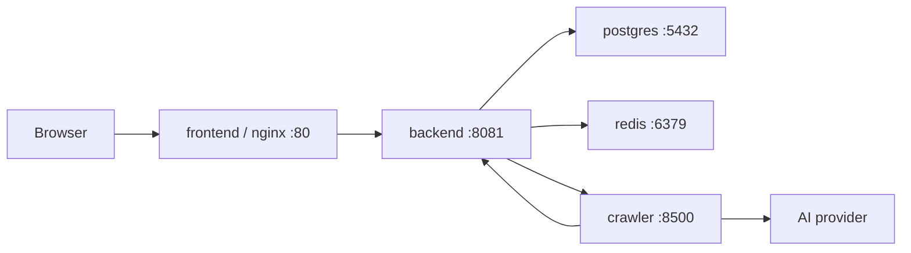

# Nanmuli Blog 部署说明

> 当前版本：MVP Beta 试用版
> 最后复核：2026-06-03

## 部署结论

当前 Docker Compose 部署链路已具备 MVP 试用条件：

- `docker compose --env-file .env.example config` 通过。
- `docker compose --env-file .env.example build frontend` 通过。
- 真实 `.env` 已从仓库中移除，仓库仅保留 `.env.example`。
- 前端 Docker 构建使用 `frontend/package-lock.json` 和 `npm ci`，构建可复现。

## 目录结构

```text
deploy/
├── .env.example                  # 环境变量模板
├── docker-compose.yml            # Compose 编排
├── nginx.conf                    # 前端容器内 Nginx 配置
├── nginx/
│   └── conf.d/default.conf       # 可选 Nginx 站点配置
├── db/
│   ├── Dockerfile                # PostgreSQL 扩展镜像
│   ├── init-scripts/schema.sql   # 初始化 schema
│   └── README.md
└── README.md
```

## 服务拓扑



## 快速启动

```bash
cd deploy
cp .env.example .env
# 编辑 .env，替换所有 your_*、AI_*、CORS、cookie 等配置
docker compose --env-file .env up -d --build
```

服务端口：

| 服务 | 容器名 | 宿主机端口 | 说明 |
| --- | --- | --- | --- |
| Frontend | `nanmuli-frontend` | `80` | Vue 静态资源 + API 反向代理 |
| Backend | `nanmuli-backend` | `8081` | Spring Boot API |
| Crawler | `nanmuli-crawler` | `8500` | FastAPI/Crawl4AI |
| PostgreSQL | `nanmuli-postgres` | `5433` | 映射到容器 `5432` |
| Redis | `nanmuli-redis` | `6380` | 映射到容器 `6379` |

## 必填环境变量

| 变量 | 必填 | 说明 |
| --- | --- | --- |
| `DB_PASSWORD` | 是 | PostgreSQL 密码 |
| `BLOG_SECURITY_ENCRYPTION_KEY` | 是 | 后端敏感配置加密 key，至少 16 字符 |
| `CRAWLER_API_KEY` | 是 | Backend 调用 crawler 的 key |
| `CRAWLER_CALLBACK_API_KEY` | 是 | Crawler 回调 Backend 的 key |
| `CRAWLER_SERVICE_URL` | 是 | Compose 中建议为 `http://crawler:8500` |
| `CRAWLER_CALLBACK_URL` | 是 | Compose 中建议为 `http://backend:8081/api/internal/collector/callback` |
| `CORS_ALLOWED_ORIGINS` | 是 | 前端访问域名 |
| `COOKIE_SECURE` | 是 | HTTPS 环境建议 `true` |
| `AI_ENABLED` | 视需求 | 是否启用 AI |
| `AI_API_KEY` | AI 启用时必填 | AI provider key |
| `AI_BASE_URL` | AI 启用时必填 | OpenAI-compatible endpoint |
| `AI_MODEL` | AI 启用时必填 | 试用环境使用 `deepseek-v4-pro` |
| `DIGEST_ENABLED` | 视需求 | 是否启用定时日报 |

## 常用命令

```bash
# 查看配置展开结果
docker compose --env-file .env config

# 启动
docker compose --env-file .env up -d --build

# 查看状态
docker compose --env-file .env ps

# 查看日志
docker compose --env-file .env logs -f backend
docker compose --env-file .env logs -f crawler
docker compose --env-file .env logs -f frontend

# 重启单个服务
docker compose --env-file .env restart backend

# 停止服务
docker compose --env-file .env down

# 删除数据卷，谨慎使用
docker compose --env-file .env down -v
```

## 健康检查

```bash
curl http://localhost:8081/actuator/health
curl http://localhost:8500/health
curl http://localhost/api/digest/latest
```

预期：

- Backend health 返回 `UP`。
- Crawler health 返回 `healthy`。
- 公开日报接口在有日报数据时返回 `200 success`。

## 上线检查清单

- [ ] 已创建真实 `deploy/.env`，且未提交到 Git。
- [ ] 数据库密码、crawler key、callback key 已替换。
- [ ] `BLOG_SECURITY_ENCRYPTION_KEY` 已替换为强随机值。
- [ ] 生产域名已写入 `CORS_ALLOWED_ORIGINS`。
- [ ] HTTPS 环境已设置 `COOKIE_SECURE=true`。
- [ ] AI key、base URL、model 已配置并可用。
- [ ] `DIGEST_ENABLED=true` 仅在确认信息源配置完成后开启。
- [ ] `docker compose --env-file .env config` 通过。
- [ ] `docker compose --env-file .env up -d --build` 启动成功。
- [ ] Backend、Crawler、Frontend 三方健康检查通过。
- [ ] 管理端可登录，日报可手动触发。
- [ ] 公开页面可访问最新日报。

## 已知风险

- Crawler 依赖外部站点和搜索引擎，日报质量会随信息源变化波动。
- AI provider 不可用时，日报生成质量会下降或任务失败。
- 试用期建议保留人工审查，不建议直接承诺完全自动发布。
- 前端 dev/build 工具链 audit 仍有中危项，需要后续单独升级 Vite/vue-tsc。
