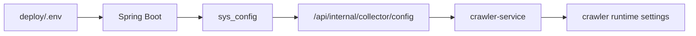

# 配置与数据库迁移现状

> 版本：v1.0
> 日期：2026-06-03
> 当前状态：MVP Beta 试用版

## 目标

当前项目将 crawler、AI、日报和自动优化相关配置统一沉淀到 Java 后端 `sys_config`，并由 Python crawler-service 刷新读取。这样可以减少外部爬虫变化或环境变量变化对系统可用性的影响。

## 当前配置链路



## 配置优先级

1. `sys_config` 中的显式配置。
2. Backend 启动时从环境变量补齐缺失配置。
3. Crawler 环境变量。
4. Crawler 默认值。

## 关键配置

| 配置 | 来源 | 说明 |
| --- | --- | --- |
| `crawler.service.base-url` | `CRAWLER_SERVICE_URL` / `sys_config` | Java 调用 crawler 地址 |
| `crawler.service.api-key` | `CRAWLER_API_KEY` / `sys_config` | Java 调用 crawler key |
| `crawler.callback.url` | `CRAWLER_CALLBACK_URL` / `sys_config` | crawler 回调 Java 地址 |
| `crawler.callback.api-key` | `CRAWLER_CALLBACK_API_KEY` / `sys_config` | 回调认证 key |
| `crawler.dependency_mode` | migration/default | 控制外部依赖降级策略 |
| `crawler.ai.base_url` | AI env/sys_config | AI endpoint |
| `crawler.ai.model` | AI env/sys_config | AI model |
| `crawler.ai.api_key` | AI env/sys_config | AI key |
| `crawler.digest.enabled` | env/sys_config | 是否启用定时日报 |
| `crawler.optimization.enabled` | env/sys_config | 是否启用自动优化 |

## 数据库迁移基线

当前新增或关键迁移包括：

| 迁移 | 说明 |
| --- | --- |
| `V1_13__add_digest_optimization_and_pipeline_configs.sql` | 日报、优化、pipeline 配置 |
| `V1_15__add_missing_optimization_configs.sql` | 补齐优化配置 |
| `V1_16__add_source_effectiveness_columns.sql` | 信息源效能字段 |
| `V1_20__fix_config_defaults_and_add_missing.sql` | 修复配置默认值和缺失项 |
| `V1_22__add_crawler_dependency_mode_config.sql` | 增加 crawler dependency mode 配置 |

## 启动补齐机制

`SystemConfigInitializer` 在后端启动时执行：

- 补齐缺失的 crawler 配置。
- 从环境变量 seed crawler service/callback 配置。
- 避免空 key 导致内部接口误开放。
- 保持 `sys_config` 作为运行时配置中心。

## 上线注意事项

- 真实 `.env` 不允许提交到仓库。
- `deploy/.env.example` 只保留模板值。
- 试用环境必须手动设置真实 API key。
- 如果修改 `sys_config` 中的 crawler 配置，需要触发 crawler refresh 或重启 crawler。
- 配置变更后建议调用 `/health` 和一次手动日报任务验证。

## 验证命令

```bash
cd backend
mvn test

cd ../deploy
docker compose --env-file .env.example config
```

## 后续计划

- 增加配置页面的分组说明和敏感字段提示。
- 增加 crawler 配置刷新按钮和刷新结果提示。
- 增加配置校验 API，提前发现缺失 key、错误 endpoint、AI 不可用等问题。
- 增加配置导出/备份能力。
