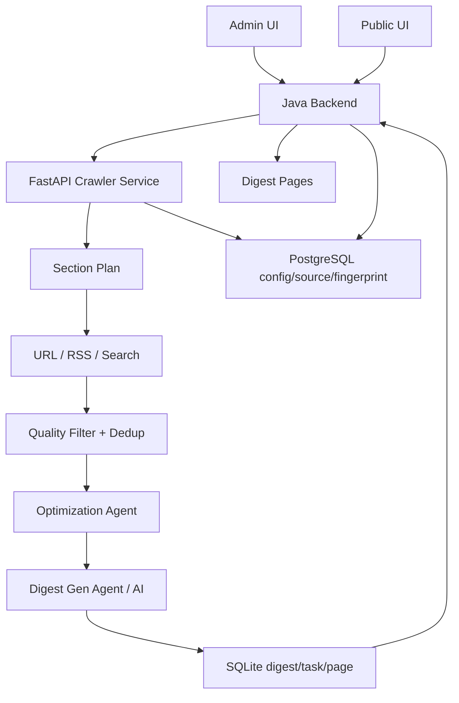
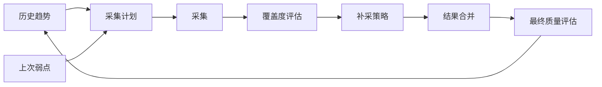

# 技术日报系统与自动优化系统

> 当前版本：MVP Beta 试用版
> 最后更新：2026-06-03
> 覆盖范围：Python crawler-service、Java Backend、Vue Frontend、AI 生成、自动优化

## 系统定位

技术日报系统负责每天从多个信息源采集技术内容，通过 AI 整理成结构化日报，并在博客公开端和管理端展示。

自动优化系统负责记录日报质量、识别弱点、给出改进建议，并为下一轮采集计划提供反馈。当前属于 **轻闭环**：系统已经能识别和记录问题，后续重点是把建议变成更强的采集约束。

## MVP Beta 结论

当前系统已具备初步上线试用条件：

- 管理端可以手动触发日报。
- Scheduler 可以按工作日定时触发。
- Crawler 可以采集 keyword/url/rss/mixed 来源。
- AI 可以生成结构化日报内容。
- 日报 sections/items 可以保存并查询。
- 自动优化可以记录评分、趋势、弱点和优化记录。
- Java 后端可以代理公开/管理端日报 API。
- Vue 前端可以展示日报列表、详情、任务状态和信息源管理。

## 架构



## 关键模块

| 模块 | 文件/位置 | 说明 |
| --- | --- | --- |
| 日报总编排 | `crawler-service/crawler/digest_orchestrator.py` | 规划、采集、去重、优化、生成、评估 |
| 日报生成 Agent | `crawler-service/crawler/digest_gen_agent.py` | 结构化日报 Prompt 与 AI 输出处理 |
| 自动优化 Agent | `crawler-service/crawler/optimization_agent.py` | 覆盖度评估、弱板块识别、补采与记录 |
| 任务执行 | `crawler-service/standalone/task_executor.py` | 任务状态机、爬取、AI 整理、callback |
| 任务 API | `crawler-service/standalone/routes.py` | `/api/v1/tasks`、`/api/v1/digests`、optimization API |
| 配置同步 | `crawler-service/standalone/backend_config.py` | 从 Java 后端拉取配置 |
| Backend proxy | `backend/.../WebCollectorController.java` | 管理端日报/采集器代理 |
| Public proxy | `backend/.../PublicDigestController.java` | 公开日报代理 |
| Internal API | `backend/.../InternalCallbackController.java` | 回调、配置、来源、fingerprint、authority |
| 管理前端 | `frontend/src/views/admin/digest/` | 管理日报列表/详情/任务页 |
| 公开前端 | `frontend/src/views/digest/` | 公开日报列表/详情 |

## 任务状态机

```text
PENDING(0) -> CRAWLING(1) -> PROCESSING(2) -> COMPLETED(3)
                                  └---------> FAILED(4)
```

终态：

- `COMPLETED`
- `FAILED`

终态任务应在管理端显示稳定状态，后续优化目标是统一完成态进度为 `100%`。

## 日报生成流程

1. 管理端或 scheduler 触发日报任务。
2. Crawler 创建 `task_type=digest` 任务。
3. `DigestOrchestrator` 读取配置、信息源、历史质量趋势和弱点。
4. 按 section 并行采集 keyword/url/rss/mixed 来源。
5. 对采集结果做 URL 去重、内容去重、质量过滤、历史 fingerprint 过滤。
6. `OptimizationAgent` 评估 section 覆盖度，必要时补采。
7. `DigestGenAgent` 调用 OpenAI-compatible AI 生成结构化日报。
8. 保存 `digest_section`、`digest_item`、最终质量评估。
9. Crawler 通过 callback 通知 Java 后端。
10. Java 后端同步任务状态并向前端提供代理 API。

## 自动优化流程



当前已实现：

- 记录 `optimization_record`。
- 记录 `digest_final_eval`。
- 趋势 API 可查询。
- 可识别来源多样性、深度、时间覆盖、语言覆盖等弱点。
- 可生成弱点建议。

后续增强：

- 把最终弱点转成下一轮强约束。
- 对重复来源、语言覆盖、低质量技术文章做策略化修正。
- 增加 structured action，避免只停留在自然语言建议。

## 数据存储

### Python SQLite

| 表 | 说明 |
| --- | --- |
| `crawl_task` | 任务、日报元数据、AI 结果 |
| `crawl_page` | 采集页面内容 |
| `digest_section` | 日报章节 |
| `digest_item` | 日报条目 |
| `optimization_record` | 优化记录 |
| `digest_final_eval` | 最终质量评估 |

### Java PostgreSQL

| 表 | 说明 |
| --- | --- |
| `web_collect_source` | 信息源配置和来源效能 |
| `digest_fingerprint` | 跨日 URL/内容 fingerprint |
| `source_authority` | 来源可信度 |
| `sys_config` | crawler/AI/digest/optimization 配置中心 |

## 关键 API

### 公开日报

| 方法 | 路径 | 说明 |
| --- | --- | --- |
| GET | `/api/digest` | 日报列表 |
| GET | `/api/digest/latest` | 最新日报 |
| GET | `/api/digest/{date}` | 按日期查询 |

### 管理日报

| 方法 | 路径 | 说明 |
| --- | --- | --- |
| POST | `/api/admin/collector/digest/trigger` | 手动触发日报 |
| GET | `/api/admin/collector/digest` | 管理日报列表 |
| GET | `/api/admin/collector/digest/latest` | 管理最新日报 |
| GET | `/api/admin/collector/digest/{date}` | 管理按日期查询 |
| GET | `/api/admin/collector/digest/task/{taskId}` | 按任务查询详情 |
| GET | `/api/admin/collector/digest/scheduler/status` | scheduler 状态 |

### Crawler API

| 方法 | 路径 | 说明 |
| --- | --- | --- |
| POST | `/api/v1/digests/trigger` | Crawler 手动触发日报 |
| GET | `/api/v1/digests/latest` | Crawler 最新日报 |
| GET | `/api/v1/optimization/digest-trend` | 质量趋势 |
| GET | `/api/v1/tasks/{id}/optimization` | 任务优化记录 |

## 配置重点

| 配置 | 说明 |
| --- | --- |
| `crawler.digest.enabled` / `DIGEST_ENABLED` | 是否启用定时日报 |
| `crawler.digest.cron` / `DIGEST_CRON` | 默认工作日 8:00 |
| `crawler.optimization.enabled` | 是否启用优化系统 |
| `crawler.optimization.mode` | `keyword` / `digest` / `both` |
| `crawler.ai.base_url` / `AI_BASE_URL` | AI endpoint |
| `crawler.ai.model` / `AI_MODEL` | AI model |
| `crawler.ai.api_key` / `AI_API_KEY` | AI key |
| `crawler.service.api-key` / `CRAWLER_API_KEY` | Backend -> Crawler |
| `crawler.callback.api-key` / `CRAWLER_CALLBACK_API_KEY` | Crawler -> Backend |

## 质量判断标准

MVP Beta 阶段，一期日报达到以下条件可视为合格：

- 至少 3 个 section 或 6 条有效条目。
- 核心条目必须包含可访问 source URL。
- 条目不应明显重复。
- `tech_article` 应至少包含 1 条可信技术文章或官方工程博客内容。
- 管理端能看到任务状态、错误信息和质量趋势。
- 自动优化能记录本期弱点。

## 已知问题与后续优化

| 优先级 | 问题 | 后续处理 |
| --- | --- | --- |
| P1 | 外部来源波动影响质量 | 提高 RSS/官方源占比，维护来源效能 |
| P1 | 部分 open_source 来源仍可能是列表页 | 强化 GitHub repo URL 展开 |
| P1 | tech_article 可能混入泛化页面 | 增加白名单、黑名单、页面类型过滤 |
| P1 | 优化建议还未完全强制影响下一轮 | 增加 structured action 和强约束 |
| P2 | 质量诊断展示不够直观 | 管理端增加质量摘要和失败来源面板 |

## 验证命令

```bash
cd backend
mvn test

cd ../crawler-service
python -m pytest -q --tb=short

cd ../frontend
npm run build
```
