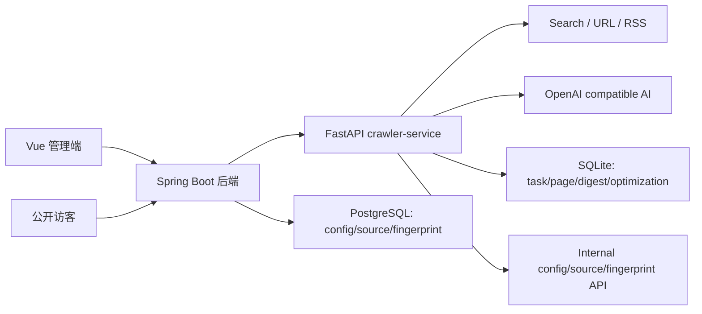

# 试用版上线与后续优化路线

> 版本：v0.1  
> 日期：2026-06-01  
> 当前定位：MVP Beta 试用版  
> 覆盖范围：技术日报系统、自动优化系统、独立爬虫服务

---

## 一、试用版结论

当前版本可以作为 **MVP Beta** 初步上线使用，适合个人博客管理员小范围试用。

试用版目标不是追求完全自动化的高质量编辑系统，而是先保证：

1. 管理员可以真实触发日报生成。
2. 系统可以自动采集、整理、保存和展示日报。
3. 自动优化系统可以记录质量趋势和问题建议。
4. 爬虫服务可以独立运行，并允许博客之外的少量内部服务调用。

---

## 二、当前能力边界

### 2.1 已上线能力

| 模块 | 能力 | 状态 |
|------|------|------|
| 日报触发 | 管理端手动触发、强制重新生成 | ✅ 可用 |
| 定时调度 | 工作日 8:00 自动生成 | ✅ 可用 |
| 多源采集 | keyword / url / rss / mixed section | ✅ 可用 |
| AI 整理 | OpenAI 兼容模型生成标题、摘要、sections、items | ✅ 可用 |
| 结构化保存 | `digest_section`、`digest_item`、任务元数据 | ✅ 可用 |
| 公开展示 | `/api/digest`、`/api/digest/latest`、`/api/digest/{date}` | ✅ 可用 |
| 管理展示 | `/admin/digest`、`/admin/digest/task/{id}` | ✅ 可用 |
| 自动优化 | 质量评分、趋势记录、弱点建议、优化记录 | ✅ 初步可用 |
| 配置中心 | Java `sys_config` 下发 crawler 配置，Python 可刷新 | ✅ 可用 |
| 独立服务 | `crawler-service` 可被其他内部服务通过 HTTP 调用 | ✅ 可用 |

### 2.2 暂不承诺能力

| 能力 | 当前状态 | 说明 |
|------|----------|------|
| 完全无人值守高质量日报 | 暂不承诺 | 外部信息源波动大，仍需人工抽检 |
| 强事实核查 | 暂不承诺 | 当前主要依赖来源 URL 和 AI 摘要，不做多源交叉验证 |
| 大规模多租户调用 | 暂不承诺 | 当前预期最多博客 + 1 个内部服务 |
| 实时资讯监控 | 暂不承诺 | 当前定位是 daily digest，不做实时流 |
| 独立 SaaS 化 | 暂不承诺 | 当前是独立服务能力，不是完整产品化平台 |

---

## 三、验证基线

最近一次全量检查基于本地开发环境：

| 项目 | 结果 |
|------|------|
| Crawler 健康检查 | `/health` 返回 healthy |
| AI 配置 | `deepseek-v4-pro` 可用 |
| Scheduler | 已运行，cron 为 `0 8 * * 1-5` |
| Backend 健康检查 | `/actuator/health` 返回 UP |
| 前端管理页 | Playwright 打开日报详情页成功，无 console warning/error |
| 公开接口 | `/api/digest/latest` 返回 `200 success` |
| 后端编译 | `mvn -q -DskipTests compile` 通过 |
| 前端构建 | `npm run build` 通过 |
| 爬虫测试 | 日报/优化关键测试 `77 passed` |
| 真实日报任务 | `task_id=71`，`2026-06-01`，状态 COMPLETED |

任务 `71` 生成结果：

- 采集页数：`21`
- 完成页数：`20`
- AI 耗时：约 `68s`
- AI token：`13788`
- section：热点动态、开源项目、技术文章
- 最新质量分：`overall_score=0.896`
- 结构化输出评分：`0.981`

---

## 四、当前架构基线

### 4.1 日报生成链路

1. 管理端或 scheduler 触发日报任务。
2. `DigestOrchestrator` 构建 section 计划。
3. 爬虫服务按 keyword/url/rss/mixed 采集。
4. 去重、质量过滤、section document 聚合。
5. `OptimizationAgent` 根据覆盖度决定是否补采。
6. `DigestGenAgent` 生成结构化日报。
7. 保存日报 sections/items、指纹和最终质量评估。
8. 前端通过 backend proxy 查看结果。

### 4.2 自动优化链路

1. 读取历史质量趋势和上一轮弱点。
2. 采集完成后评估 section 覆盖度。
3. 对弱 section 生成补采策略。
4. 保存优化轮次。
5. 日报成品保存 `digest_final_eval`。
6. 下一次生成时读取趋势和弱点作为规划参考。

当前属于轻反馈：系统已经能发现问题和记录趋势，但还需要把建议转成更强的采集约束。

---

## 五、上线试用配置建议

### 5.1 必填配置

| 配置 | 建议 |
|------|------|
| `crawler.service.base-url` | 指向 crawler-service，例如 `http://localhost:8500` |
| `crawler.service.api-key` | 生产/试用环境必须非空 |
| `crawler.callback.api-key` | 生产/试用环境必须非空 |
| `crawler.ai.api_key` | 使用受控密钥，不写入仓库 |
| `crawler.ai.base_url` | OpenAI 兼容端点 |
| `crawler.ai.model` | 当前试用为 `deepseek-v4-pro` |
| `crawler.digest.enabled` | 试用环境设为 `true` |
| `crawler.optimization.enabled` | 试用环境设为 `true` |
| `crawler.optimization.mode` | 建议 `both` |

### 5.2 首批信息源建议

| section | 类型 | 建议 |
|---------|------|------|
| hot_trend | mixed | GitHub Blog RSS + HN RSS + AI/security/developer news 关键词 |
| open_source | url + keyword | GitHub Trending + open source release/developer tool 关键词 |
| tech_article | keyword | 优先官方工程博客和高质量技术站点，减少泛关键词 |

---

## 六、已知问题与优先级

| 优先级 | 问题 | 影响 | 建议 |
|--------|------|------|------|
| P0 | 完成态进度可能显示 95% | 影响管理端观感 | COMPLETED/FAILED 统一终态进度 |
| P1 | GitHub Trending 多条目共用列表页 URL | 影响来源可追溯 | 提取 repo 级 URL，输出前强去重 |
| P1 | tech_article 候选池混入泛化定义页 | 拉低日报深度 | 增加 generic content penalty |
| P1 | 自动优化建议没有完全强制影响下一轮 | 质量提升速度慢 | 将 weakness 转成 plan constraint |
| P2 | 外部站点反爬导致部分源失败 | 结果波动 | 增加稳定 RSS/官方源占比 |
| P2 | PowerShell 查看中文 JSON 可能乱码 | 调试体验 | 使用 UTF-8 终端或浏览器查看 |

---

## 七、后续开发路线

### Beta-1：质量稳定化

目标：让每天生成的日报稳定达到“可读、可信、来源清晰”。

- 修复完成态进度显示。
- 修复重复 `source_url`。
- GitHub Trending 输出 repo 级 URL。
- 技术文章过滤定义页、下载页、营销页。
- 给日报详情页增加质量诊断摘要。

验收标准：

- 完成任务进度显示 `100%`。
- 成品日报 `duplicate_source_count=0`。
- `tech_article` 至少 1 条来自可信技术站点或官方工程博客。
- 管理端能看到质量分和主要优化建议。

### Beta-2：自动优化强反馈

目标：让自动优化真正影响下一次日报生成质量。

- 将 `language_coverage` 低分转成跨语言补采约束。
- 将重复来源建议转成输出前强去重。
- 将 `tech_article` 质量问题转成下一轮 site 白名单或黑名单。
- 为 `digest_final_eval` 增加可消费的 structured action。

验收标准：

- 连续两次日报中，同类弱点不应重复出现而无策略变化。
- 趋势接口能看到策略调整原因。
- 测试覆盖“最终评估 → 下一轮计划”的闭环。

### Beta-3：独立服务接入增强

目标：让 crawler-service 可以稳定服务博客之外的第二个内部服务。

- 补充 API Key 使用示例。
- 明确 callback payload。
- 增加 client 接入文档。
- 对 `/api/v1/tasks` 和 `/api/v1/digests/*` 做兼容性说明。
- 梳理错误码和重试策略。

验收标准：

- 新服务只需 base URL + API key 即可创建任务并轮询结果。
- callback 可选，不影响任务完成。
- 博客系统仍作为一个普通 client 工作。

### Beta-4：发布前运维完善

目标：降低试用期间的排查成本。

- 增加日报任务日志 trace id。
- 增加最近失败源列表。
- 增加 scheduler 状态面板。
- 增加每日生成结果的简短健康报告。

验收标准：

- 管理员能在 3 分钟内判断失败原因属于 AI、搜索、源站、配置还是回调。

---

## 八、上线试用操作清单

- [ ] 设置 crawler API key 和 callback key。
- [ ] 设置 AI base URL、model、API key。
- [ ] 启用 `crawler.digest.enabled`。
- [ ] 启用 `crawler.optimization.enabled`。
- [ ] 配置至少 3 个 section 信息源。
- [ ] 手动触发一次日报。
- [ ] 检查 `/admin/digest/task/{id}`。
- [ ] 检查 `/api/digest/latest`。
- [ ] 检查 `/api/v1/optimization/digest-trend`。
- [ ] 保存一次验证记录，作为试用期 baseline。

---

## 九、试用版判定标准

达到以下条件，即认为 MVP Beta 试用通过：

1. 连续 3 个工作日能自动生成日报。
2. 每期日报至少包含 3 个 section 或不少于 6 条有效条目。
3. 每条核心条目有可访问 source URL。
4. 日报生成失败时能在管理端看到失败状态和错误信息。
5. 优化趋势能持续记录，并能解释主要质量问题。

若连续 2 天出现空日报、明显重复、严重幻觉或 AI 不可用，应暂停自动发布，改为管理员手动触发和审阅。
