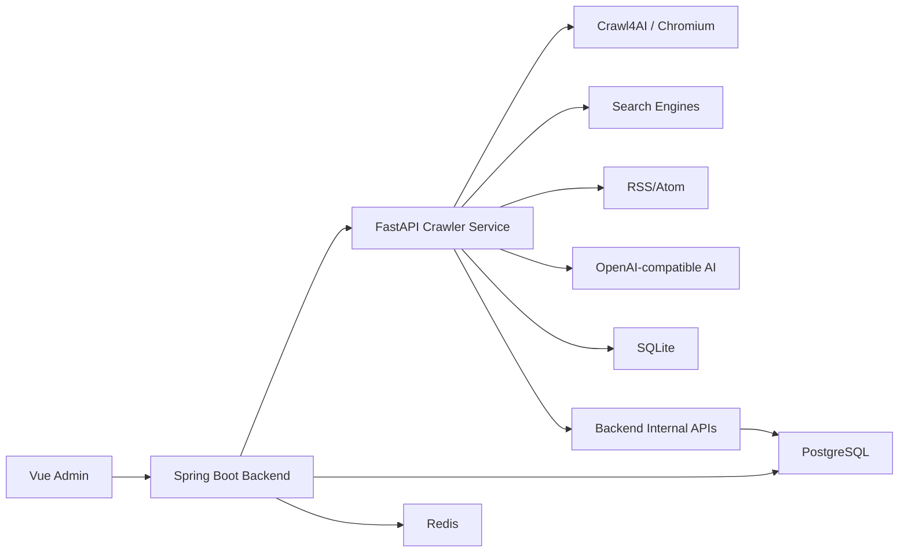

# Web Collector 模块设计

> 版本：v3.0
> 日期：2026-06-03
> 当前状态：MVP Beta 试用版

## 模块定位

Web Collector 是 Nanmuli Blog 的内容采集与整理系统，当前由 Java 后端、Python crawler-service 和 Vue 管理端共同组成。

它支持三类使用场景：

1. **单页/深度采集**：将网页内容采集为 Markdown，并可通过 AI 整理。
2. **关键词采集**：从搜索结果中采集多个来源，生成综合整理结果。
3. **技术日报**：按信息源和 section 定时采集，生成每日技术日报。

当前 crawler-service 已具备独立 HTTP 服务能力，博客只是它的一个 client。

## 当前 MVP 能力

| 功能 | 状态 | 说明 |
| --- | --- | --- |
| 单页采集 | 可用 | `/crawl/single` 和异步 task |
| 深度采集 | 可用 | BFS，同域限制、深度/页数上限 |
| 关键词搜索采集 | 可用 | 多搜索引擎，失败降级 |
| RSS/Atom 采集 | 可用 | 按 freshness 过滤 |
| AI 整理 | 可用 | OpenAI-compatible endpoint |
| 任务管理 | 可用 | 创建、查询、重试、删除、导出 |
| 信息源管理 | 可用 | 管理端 CRUD，按 section 分组 |
| 日报生成 | MVP 可用 | 手动/定时触发、结构化保存 |
| 自动优化 | MVP 可用 | 质量评分、趋势、弱点建议 |
| 独立服务调用 | MVP 可用 | API key + task API + optional callback |

## 架构



## 职责划分

| 层 | 职责 |
| --- | --- |
| Vue Frontend | 管理任务、信息源、日报，展示采集结果和任务状态 |
| Java Backend | 认证、配置中心、信息源管理、任务代理、内部回调、fingerprint 持久化 |
| Python Crawler | 任务执行、采集、AI 整理、日报生成、自动优化、scheduler |
| PostgreSQL | 博客业务数据、系统配置、信息源、fingerprint、source authority |
| SQLite | Crawler 本地任务、页面、日报、优化记录 |

## 数据模型

### Java PostgreSQL

| 表 | 说明 |
| --- | --- |
| `web_collect_task` | Java 侧采集任务映射和同步状态 |
| `web_collect_source` | 信息源配置、运行状态、质量 EMA |
| `digest_fingerprint` | 跨日去重 fingerprint |
| `source_authority` | 来源可信度 |
| `sys_config` | crawler/AI/digest/optimization 配置中心 |

### Python SQLite

| 表 | 说明 |
| --- | --- |
| `crawl_task` | Crawler 任务和 AI 元数据 |
| `crawl_page` | 单页/多页采集结果 |
| `digest_section` | 日报 section |
| `digest_item` | 日报条目 |
| `optimization_record` | 优化过程记录 |
| `digest_final_eval` | 最终日报质量评估 |

## 任务类型

| task_type | 说明 |
| --- | --- |
| `single` | 单页采集 |
| `deep` | 深度采集 |
| `keyword` | 关键词搜索采集 |
| `digest` | 技术日报 |

## 任务状态

| 值 | 状态 | 说明 |
| --- | --- | --- |
| 0 | PENDING | 已创建，等待执行 |
| 1 | CRAWLING | 正在采集 |
| 2 | PROCESSING | 正在 AI 整理或生成 |
| 3 | COMPLETED | 完成 |
| 4 | FAILED | 失败 |

## 配置来源

当前优先级：

1. Java `sys_config`。
2. Crawler 环境变量。
3. Crawler 本地默认值。

关键配置由 Java 后端通过内部 API 下发，crawler 可通过 refresh 重新读取。

## 外部服务接入方式

外部内部服务接入 crawler-service 时，建议只依赖稳定任务 API：

1. 调用 `/health` 检查服务。
2. 使用 `X-API-Key` 创建 `/api/v1/tasks`。
3. 轮询 `/api/v1/tasks/{id}`。
4. 可选配置 `callback_url` 接收完成通知。
5. 需要日报时查询 `/api/v1/digests/*`。

不建议外部服务直接依赖博客后端内部 API。

## 安全边界

- Crawler API 必须开启 `AUTH_ENABLED=true`。
- API key 不提交到仓库。
- Callback key 和 client callback token 分开。
- SSRF 防护保持开启。
- 当前不建议将 crawler-service 作为公网开放平台。

## 当前已知问题

| 问题 | 影响 | 后续计划 |
| --- | --- | --- |
| 外部源结构变化 | 采集质量波动 | 来源效能、RSS/官方源、失败源面板 |
| 搜索引擎反爬 | 关键词结果不稳定 | 限流、代理、稳定来源优先 |
| 自动优化轻反馈 | 质量提升慢 | structured action + 强约束 |
| dev 工具链 audit | 不影响运行时 | 单独升级 Vite/vue-tsc |

## 验证命令

```bash
cd crawler-service
python -m pytest -q --tb=short

cd ../backend
mvn test

cd ../frontend
npm run build
```
